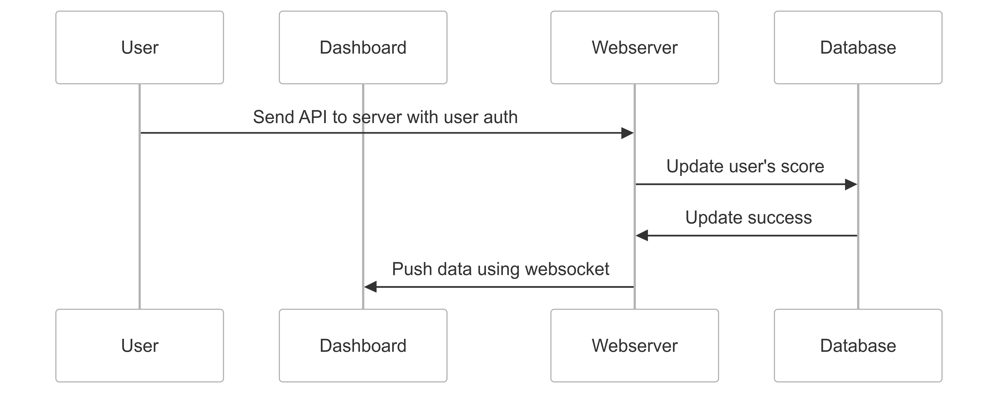

# Task

Write the specification for a software module on the API service (backend application server).

1. Create a documentation for this module on a `README.md` file.
2. Create a diagram to illustrate the flow of execution.
3. Add additional comments for improvement you may have in the documentation.
4. Your specification will be given to a backend engineering team to implement.

### Software Requirements

1. We have a website with a score board, which shows the top 10 user’s scores.
2. We want live update of the score board.
3. User can do an action (which we do not need to care what the action is), completing this action will increase the user’s score.
4. Upon completion the action will dispatch an API call to the application server to update the score.
5. We want to prevent malicious users from increasing scores without authorisation.

### Objective

- Build API trigger by user action
- Only allow authenticated user to access API
- Able to update user's score
- Live update score board

#### Sequence Diagram

#### API Flowchart

#### Appendix

- [Sequence Diagram](./src/seq.md)
- [API Flowchart](./src/flow.md)
