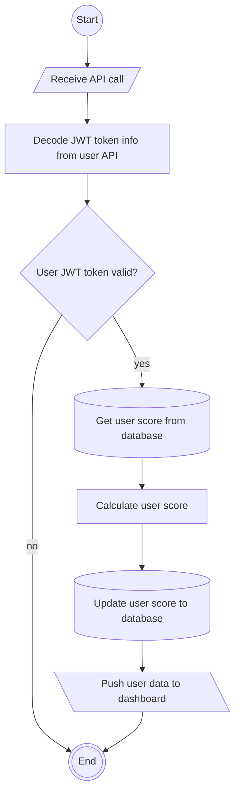

# API Flowchart

```mermaid
flowchart TD
    start@{ shape: circle, label: "Start" }
    input1@{ shape: lean-r, label: "Receive API call" }
    process1@{ shape: rect, label: "Decode JWT token info from user API" }
    if1@{ shape: diamond, label: "User JWT token valid?" }
    db1@{ shape: cyl, label: "Get user score from database" }
    process2@{ shape: rect, label: "Calculate user score" }
    db2@{ shape: cyl, label: "Update user score to database" }
    output1@{ shape: lean-l, label: "Push user data to dashboard" }
    ending@{ shape: dbl-circ, label: "End" }
    start --> input1 --> process1 --> if1
    if1 -- no --> ending
    if1 -- yes --> db1 --> process2 --> db2 --> output1 --> ending
```
