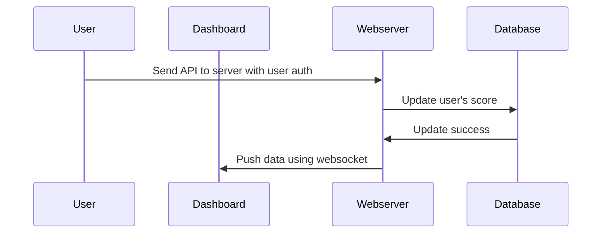

# Sequence Diagram

```mermaid
sequenceDiagram
    participant User
    participant Dashboard
    participant Webserver
    participant Database
    User->>Webserver: Send API to server with user auth
    Webserver->>Database: Update user's score
    Database->>Webserver: Update success
    Webserver->>Dashboard: Push data using websocket
```
